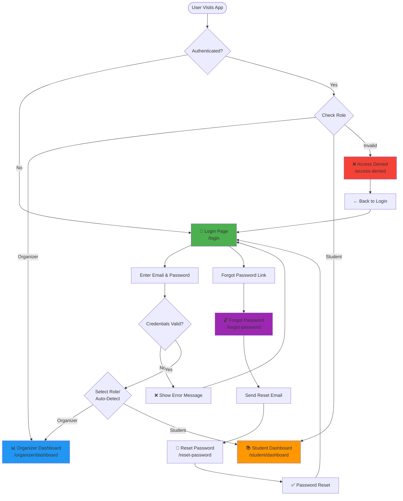
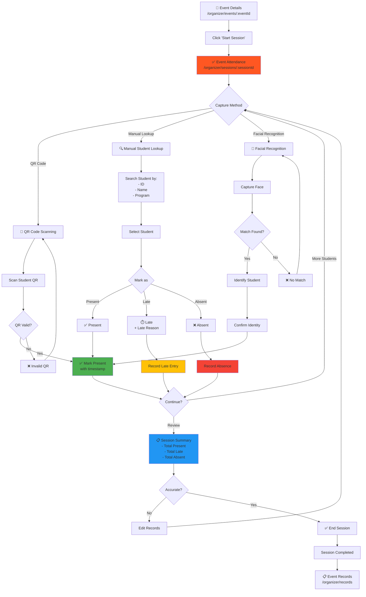
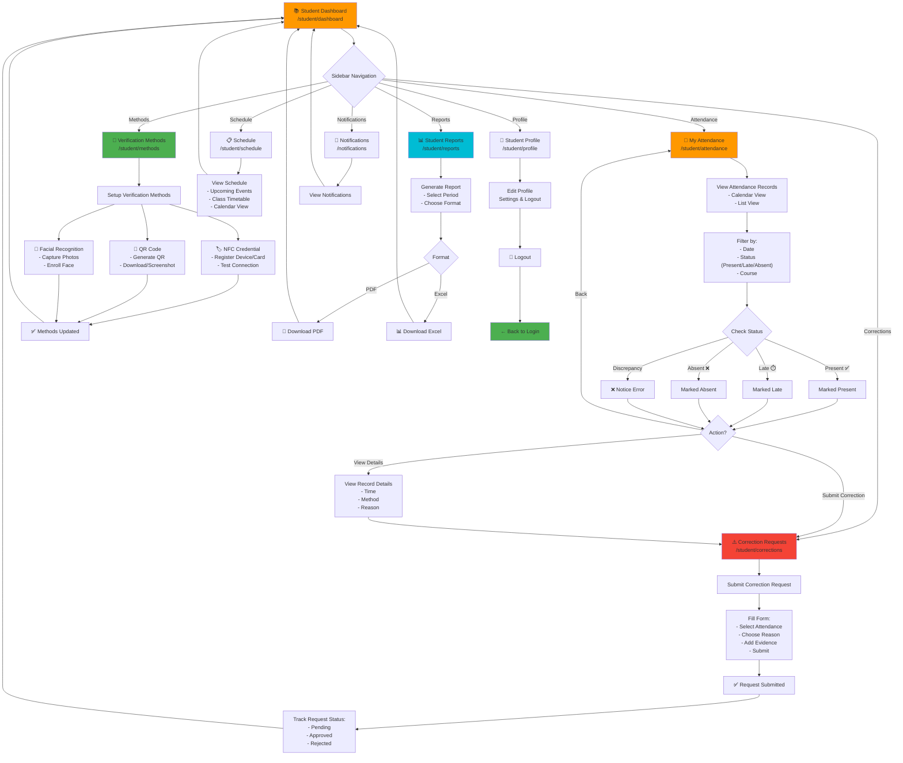
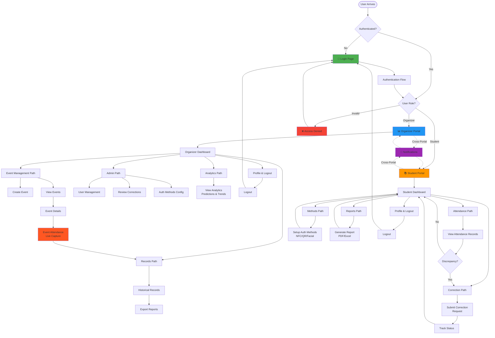

# PLPass User Flow Diagrams

Complete visual flows for all pages and user journeys in the PLPass application.

---

## 1. Authentication & Access Flow



---

## 2. Organizer Portal Navigation Flow

```mermaid
graph TD
    OrgDash["📊 Organizer Dashboard<br/>/organizer/dashboard"]
    
    OrgDash --> NavChoice{Sidebar Navigation}
    
    NavChoice -->|Events| EventMgmt["📅 Event Management<br/>/organizer/events"]
    NavChoice -->|Create Event| CreateEvent["✏️ Create Event<br/>/organizer/events/create"]
    NavChoice -->|Records| EventRecords["📋 Event Records<br/>/organizer/records"]
    NavChoice -->|Users| UserMgmt["👥 User Management<br/>/organizer/users"]
    NavChoice -->|Corrections| OrgCorrections["⚠️ Correction Requests<br/>/organizer/corrections"]
    NavChoice -->|Methods| AuthMethods["🔐 Authentication Methods<br/>/organizer/reports"]
    NavChoice -->|Analytics| Analytics["📈 Analytics Insights<br/>/organizer/analytics"]
    NavChoice -->|Profile| OrgProfile["👤 Organizer Profile<br/>/organizer/profile"]
    NavChoice -->|Notifications| Notif["🔔 Notifications<br/>/notifications"]
    
    EventMgmt --> EventChoice{Action}
    EventChoice -->|View Event| EventDetails["📌 Event Details<br/>/organizer/events/:eventId"]
    EventChoice -->|Create New| CreateEvent
    EventChoice -->|Back| OrgDash
    
    CreateEvent --> CreateForm["Fill Event Form<br/>- Venue<br/>- Time<br/>- Category<br/>- Objectives"]
    CreateForm --> SaveEvent["Save Event"]
    SaveEvent --> EventMgmt
    
    EventDetails --> SessionChoice{Session Action}
    SessionChoice -->|View Sessions| SessionList["List Sessions"]
    SessionChoice -->|Start New Session| EventAttendance["✅ Event Attendance<br/>/organizer/sessions/:sessionId"]
    SessionChoice -->|View Participants| ParticipantList["List Participants"]
    SessionChoice -->|Back| EventMgmt
    
    EventRecords --> RecordsFilter["Filter by:<br/>- Today<br/>- Incoming<br/>- Completed"]
    RecordsFilter --> ViewRecord{Select Record}
    ViewRecord -->|View Details| EventAttendance
    ViewRecord -->|Generate Report| ExportReport["Export Report"]
    ExportReport --> RecordsTab["Back to Records"]
    RecordsTab --> EventRecords
    
    UserMgmt --> ManageUsers["Manage Users<br/>- Add/Remove<br/>- Assign Roles<br/>- Edit Permissions"]
    ManageUsers --> OrgDash
    
    OrgCorrections --> ReviewRequests["Review Student<br/>Correction Requests"]
    ReviewRequests --> ApprovalAction{Action}
    ApprovalAction -->|Approve| Approve["✅ Approve Request"]
    ApprovalAction -->|Reject| Reject["❌ Reject Request"]
    Approve --> OrgDash
    Reject --> OrgDash
    
    AuthMethods --> ConfigAuth["Configure Auth Methods<br/>- NFC<br/>- QR Code<br/>- Facial Recognition"]
    ConfigAuth --> OrgDash
    
    Analytics --> ViewMetrics["View Analytics<br/>- Predictions<br/>- Attendance Trends<br/>- Feedback<br/>- Late Arrivals"]
    ViewMetrics --> OrgDash
    
    OrgProfile --> EditProfile["Edit Profile<br/>Settings & Logout"]
    EditProfile --> LogoutOrg["🚪 Logout"]
    LogoutOrg --> LoginPage["← Back to Login"]
    
    Notif --> ViewNotif["View Notifications"]
    ViewNotif --> OrgDash
    
    style OrgDash fill:#2196F3
    style EventMgmt fill:#2196F3
    style CreateEvent fill:#4CAF50
    style EventDetails fill:#2196F3
    style EventAttendance fill:#FF5722
    style EventRecords fill:#2196F3
    style Analytics fill:#00BCD4
    style OrgProfile fill:#757575
    style LoginPage fill:#4CAF50
```



---

## 3. Organizer Event Attendance Capture Flow



---

## 4. Student Attendance Verification Flow



---

## 5. Complete Application Flow Map



---

## 6. Page-by-Page Quick Reference

### Public Pages
| Page | Route | Entry Point | Next Pages |
|------|-------|------------|-----------|
| **Login** | `/login` | Start | Dashboard (role-based), Forgot Password |
| **Forgot Password** | `/forgot-password` | Login link | Reset Password |
| **Reset Password** | `/reset-password` | Email link | Login |
| **Access Denied** | `/access-denied` | Invalid role | Login |
| **Profile** | `/profile` | Header (role-aware) | Previous page, Logout → Login |
| **Notifications** | `/notifications` | Header bell | Previous page |
| **Not Found** | `/*` | Invalid URL | Any route |

### Organizer Pages
| Page | Route | Parent | Child Pages |
|------|-------|--------|------------|
| **Dashboard** | `/organizer/dashboard` | Portal Root | All organizer pages |
| **Event Management** | `/organizer/events` | Dashboard | Event Details, Create Event |
| **Create Event** | `/organizer/events/create` | Event Management | Event Management |
| **Event Details** | `/organizer/events/:eventId` | Event Management | Event Attendance, Event Details (sessions tab) |
| **Event Attendance** | `/organizer/sessions/:sessionId` | Event Details | Event Records |
| **Event Records** | `/organizer/records` | Dashboard | Event Attendance, Dashboard |
| **User Management** | `/organizer/users` | Dashboard | Dashboard |
| **Corrections** | `/organizer/corrections` | Dashboard | Dashboard |
| **Auth Methods** | `/organizer/reports` | Dashboard | Dashboard |
| **Analytics** | `/organizer/analytics` | Dashboard | Dashboard |
| **Profile** | `/organizer/profile` | Header | Logout → Login |

### Student Pages
| Page | Route | Parent | Child Pages |
|------|-------|--------|------------|
| **Dashboard** | `/student/dashboard` | Portal Root | All student pages |
| **My Attendance** | `/student/attendance` | Dashboard | Student Corrections, Dashboard |
| **Verification Methods** | `/student/methods` | Dashboard | Dashboard |
| **Correction Requests** | `/student/corrections` | Dashboard, My Attendance | Dashboard |
| **Reports** | `/student/reports` | Dashboard | Dashboard |
| **Schedule** | `/student/schedule` | Dashboard | Dashboard |
| **Profile** | `/student/profile` | Header | Logout → Login |

---

## 7. Critical User Journeys

### Journey 1: Organizer Creates Event and Takes Attendance
```
Dashboard → Events → Create Event → Fill Form → Save
→ Events → View Event → Start Session → Capture Attendance (QR/Manual/Facial)
→ Review Summary → End Session → Records → View Session Record
```

### Journey 2: Student Discovers Attendance Error and Requests Correction
```
Dashboard → My Attendance → Filter by Status → Find Error
→ Submit Correction Request → Upload Evidence → Track Status
→ Wait for Approval → Check Dashboard for Result
```

### Journey 3: Organizer Reviews Analytics and Predictions
```
Dashboard → Analytics → View Predictions → Check Attendance Trends
→ Review Feedback Insights → Analyze Late Arrivals → Export Report
```

### Journey 4: Student Sets Up Verification Methods
```
Dashboard → Methods → Register NFC → Generate QR → Enable Facial
→ Test Methods → Back to Dashboard → Ready for Attendance
```

### Journey 5: Both Roles Access Notifications
```
Any Page → Click Notifications Bell → View Notifications
→ Take Action (if needed) → Back to Previous Page
```

---

## Flow Legend

| Symbol | Meaning |
|--------|---------|
| 🔐 | Security/Authentication |
| 📊 | Analytics/Dashboard |
| 📚 | Student Portal |
| 📅 | Events/Calendar |
| ✅ | Attendance/Completion |
| ⏱️ | Time/Late |
| ❌ | Errors/Denied |
| 🔔 | Notifications |
| 👥 | Users/Admin |
| 🔍 | Search/Lookup |
| 📱 | QR Code |
| 🏷️ | NFC |
| 👤 | Facial Recognition |
| 💾 | Save/Export |
| 🚪 | Logout |

