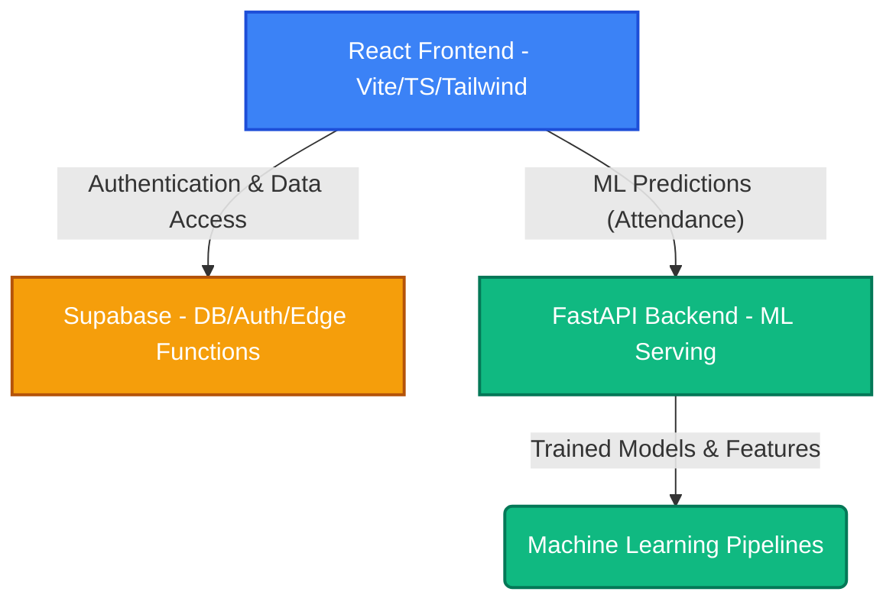

# PLPass Structure and System Design

This document details the architectural design and directory structure of the PLPass application. PLPass is divided into a frontend React application, a Python-based ML/API backend, and a Supabase database and authentication layer.

## High-Level Architecture

---

## Directory Structure

### Root Directory

- **`api/`**: Python-based backend API for ML model serving and backend services. Built with FastAPI.
- **`ml/`**: Machine Learning pipelines, data processing, model training scripts, and interpretability generation.
- **`src/`**: React frontend source code, built with Vite and TypeScript.
- **`supabase/`**: Supabase configuration, Edge Functions, and database migrations.
- **`public/`**: Static assets for the frontend.
- **`docs/`**: Documentation files (e.g., deployment runbooks, checklists).
- **`e2e/`, `e2e-supabase/`, `tests/`**: Automated test directories.
- **`scripts/`**: Utility and build scripts.
- **`dist/`**: Compiled production build for the frontend (generated).

---

### API (`api/`)

The API layer is responsible for serving machine learning models to the frontend via HTTP endpoints.

- **`main.py`**: The FastAPI application entry point, containing prediction routes (e.g., `/predict`).
- **`requirements.txt`**: Python dependencies for the API (e.g., `fastapi`, `uvicorn`, `scikit-learn`, `pandas`).
- **`models/`**: Stores serialized machine learning models and interpretability insights.
  - `attendance_model.pkl`: The trained and serialized attendance prediction model.
  - `model_insights.json`: Model interpretability metrics including Permutation Importance and Partial Dependence insights.
- **`services/`**: Core logic and integration services.
  - `supabase_client.py`: Supabase connection setup and operations.

---

### Machine Learning (`ml/`)

The machine learning directory contains scripts and pipelines used to train the model before it is serialized and moved to the `api/models/` directory for serving.

- **`data/`**: Directory for storing raw and processed datasets (typically ignored in git).
- **`feature_assembly.py`**: Script to process and assemble student and event features.
- **`train_attendance_model.py`**: Script to train the attendance prediction model, compute interpretability metrics, and export both the model and `model_insights.json`.
- **`PLPass_Event_Features.xlsx`, `PLPass_Student_Features.xlsx`**: Source feature datasets.

---

### Frontend (`src/`)

The frontend is a React application built with Vite, utilizing TypeScript and TailwindCSS for styling.

- **`app/`**: Global application configurations and contexts.
- **`components/`**: Reusable UI components.
- **`features/`**: Feature-specific logic and UI modules (e.g., Dashboard, Authentication).
- **`hooks/`**: Custom React hooks for shared logic and state management.
- **`lib/`**: Utility functions and library wrappers.
- **`pages/`**: Main application pages and top-level route components.
- **`services/`**: API and service integrations (e.g., Supabase client).
- **`test-support/`**: Testing utilities and mock data for the frontend.
- **`types/`**: TypeScript type definitions defining the shape of application state and API payloads.
- **`index.css`**: Global styles and TailwindCSS base imports.
- **`main.tsx`**: React application entry point.

---

### Supabase (`supabase/`)

The Supabase directory houses configuration and infrastructure-as-code for the project's PostgreSQL database and backend functions.

- **`config.toml`**: Supabase project configuration settings.
- **`migrations/`**: SQL migration files defining the database schema, functions, and RLS policies.
- **`functions/`**: Supabase Edge Functions for running backend logic on the edge.
- **`seed_student_test_data.sql`**: Script to populate test data for local development and CI testing.

---

### Root Level Configurations

- **`package.json` & `package-lock.json`**: Node.js dependencies and project scripts.
- **`vite.config.ts`**: Configuration for the Vite bundler.
- **`tailwind.config.ts` & `postcss.config.js`**: Styling and design system configurations.
- **`playwright.config.ts` & `playwright.supabase.config.ts`**: End-to-end testing configurations using Playwright.
- **`eslint.config.js`**: Linter rules and configuration.
- **`tsconfig.*.json`**: TypeScript compiler configurations for the app and node environments.
- **`PHASE_*.md`, `FLOWS.md`, `IMPLEMENTATION_SUMMARY.md`**: Various phase planning and tracking documents.
